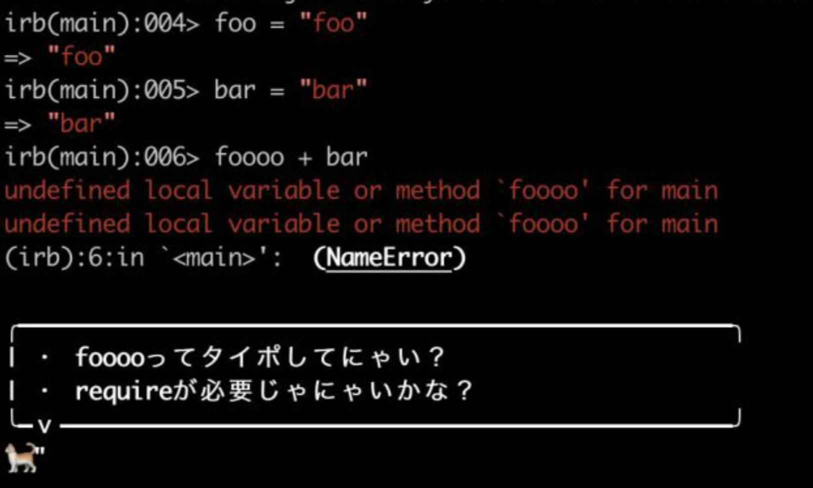

# 🔰Wakaba

Ruby の標準エラーをネコチャンが話しているように表示させる Gem です。

`Exception.prepend(MyModule)`として上書きしています。

## 対応したエラー

- NoMethodsError
- ArgentError
- NameError
- ZeroDivisionError
- TypeError

## LT スライド

https://speakerdeck.com/judeeeee/create-gem
